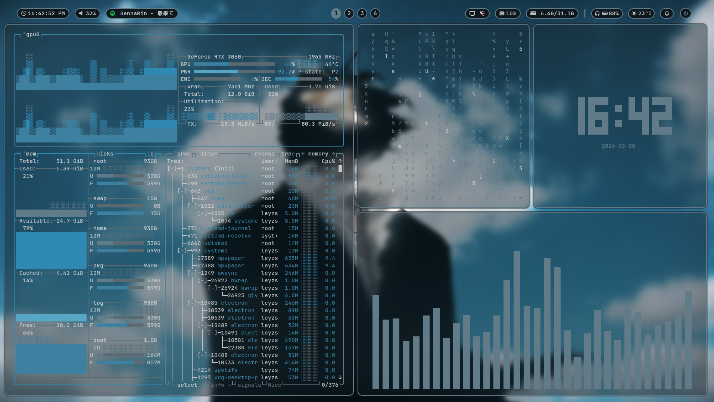

<p align="center">
  
</p>

# 🚀 **By-LeyzS Arch + Hyprland Dotfiles (V1.5)** 🏁
---

## 🚨 **IMPORTANT: MUST INSTALL FIRST**

> ⚠️ **Before copying the files, you MUST install these packages!**  
> Otherwise, the system will NOT work properly.

---

### ⚙️ **Core Components & Visuals**
```bash
sudo pacman -S hyprland waybar wofi wlogout kitty fastfetch swww swaync hyprlock pywal16 mpvpaper grim slurp wl-clipboard
```

### 🔤 **Fonts & Tools**
```bash
yay -S matugen-bin ttf-jetbrains-mono-nerd
```

---

## 🖼️ **WALLPAPER MANAGEMENT**

- 🎨 **Static Picker (WIN + W)**  
  → Pick an image from menu  
  → Folder: `~/.config/wallpapers`

- 🎲 **Randomizer (WIN + R)**  
  → Picks a random wallpaper automatically  

- 🎥 **Start Live Wallpaper (WIN + ALT + K)**  
  → Starts `.mp4` video wallpapers  
  → Folder: `~/.config/Live Wallpapers`

- 🔁 **Switch Live Wallpaper (WIN + K)**  
  → Smoothly switches between wallpapers  

- ⚡ **Mode Switching**  
  → Using `WIN + W` **automatically stops video wallpaper**

---

## 🖥️ **MONITOR SETTINGS (VERY IMPORTANT)**

> ⚠️ **Default monitor = `DP-1`**

If you have problems (black screen / Waybar issues):

1. Run:
   ```bash
   hyprctl monitors
   ```
2. Find your monitor name (example: `HDMI-A-1`)  
3. Open:
   ```
   ~/.config/hypr/configs/monitors.conf
   ```
4. Replace:
   ```
   DP-1 → YOUR MONITOR NAME
   ```

---

## ⌨️ **KEYBINDINGS**

- 🔒 **WIN + L** → Lock Screen  
- 🔍 **WIN + A** → App Launcher  
- ❌ **WIN + Q** → Close Window  
- 🛸 **WIN + F** → Floating Mode  

- 🔢 **WIN + 1 / 2 / 3 / 4** → Workspaces  
- 🚚 **WIN + SHIFT + Number** → Move Window  

---

## 🚀 **INSTALLATION**

> 📌 **Follow these steps IN ORDER**

---

### 📥 **1. Clone the Repository**
```bash
git clone https://github.com/L3yzs/By-LeyzS-Arch-Hyprland-Dotfiles.git
cd By-LeyzS-Arch-Hyprland-Dotfiles
```

---

### 📂 **2. Copy Config Files**
```bash
cp -r .config/* ~/.config/
```

---

### 🪄 **3. Fix User Paths (IMPORTANT)**
```bash
find ~/.config/ -type f -exec sed -i "s/leyzs/$(whoami)/g" {} +
```

> ✨ This command automatically replaces `leyzs` with your username  
> and fixes all paths so everything works correctly.

---

Added new animations. Enjoy!
